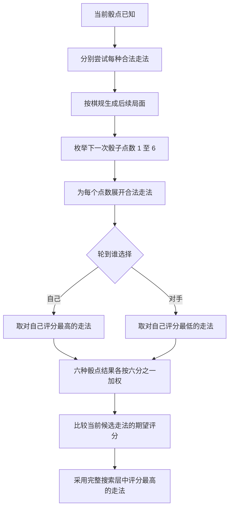

# LUDO · 一掷之间

版本：0.5.9，统一棋子外观并明确每步结果 
日期：2026年09月09日

一个玩家与电脑 1 对 1 对战的离线 Ludo 网页游戏。玩家使用红色，电脑使用黄色，双方各有 4 枚棋子。AI 是本地 JavaScript 策略，不接入 AI API，不需要后端、账号或数据库。

## 开始游戏

在线试玩：[LUDO · 一掷之间](https://ludo.tracyyun.cn/)。部署信息见[服务器部署说明](doc/服务器部署说明.md)。

1. 用桌面 Chrome 或 Edge 打开项目根目录的 `index.html`，也可以直接双击该文件。
2. 选择初级、中级、高级或终极，点击“开始对局”。先手由程序随机决定。
3. 轮到自己时点击掷骰，然后点击带箭头和深色外圈的合法棋子。电脑会自动完成其行动。
4. 先将全部 4 枚棋子送到终点的一方获胜。

`index.html` 是资源内嵌的单文件成品，运行时不需要网络，也不需要安装 Node。分享时可以只发送这个 HTML 文件。

当前对局不会自动保存。刷新或关闭页面会丢失本局进度；“重新开始”会先要求确认。页面提供玩法说明、双方到家进度、棋局动态和音效开关。

开局前后使用同一套木纹棋子。走棋后保留起点、落点和最后移动棋子的标记，棋盘下方说明这一步的结果；安全格共存会显示保护原因，普通格吃子会展示对手棋子回营。掷骰和逐格移动带有本地合成音效，右上角可以静音并记住选择。

通过页头或页脚的“版本更新”查看发布历史，也可直接访问 [版本更新页面](https://ludo.tracyyun.cn/#updates)。记录内嵌在同一个 HTML 文件中，离线可读。查看记录时暂停新行动和 AI 搜索，返回游戏继续当前棋局；切换页面不会重新开局。

## 四档 AI 的决策树逻辑

AI 在当前骰点已知后选择移动哪枚棋子。它先列出合法走法，合并结果相同的局面；如果能直接赢得整局，就立即执行，只有一种有效走法时也直接走。存在多个选择时，四档按下列方式决策：

| 等级 | 如何选择走法 | 向后推演与预算 |
| --- | --- | --- |
| 初级 | 在不同合法后继局面之间均匀随机选择 | 不推演未来骰点 |
| 中级 | 给每种走法后的局面打分，比较棋子位置、可行动性与被吃风险 | 只比较当前这一步的结果 |
| 高级 | 枚举未来骰点和双方应对，选择期望评分最高的走法 | 逐层加深，最多 12,000 次节点访问、150ms |
| 终极 v2 | 用到家成本、多子归家效率和风险评价局面，并结合概率搜索；符合条件时求解归家残局 | 常规搜索最多 60,000 次节点访问，与残局共用 600ms |

### 高级与终极如何推演

上图中的后续局面会继续按同样方式展开，直到达到本层深度或真正终局。到达深度边界时使用局面评分；骰点没有合法走法时，由棋规直接结算后继续推演。AI 假设对手会选择对自己最不利的应对，六种未来骰点各以 `1/6` 概率计算，不读取未来真实骰点。

当前 v0.5.5 的搜索也包含奖励再掷：吃子、单子到达 HOME 终点或掷出 6 后，下一次掷骰可能仍属于同一方。决策树根据棋规判断活动玩家，奖励不会被误算成换人。

### 深度和节点分别代表什么

- **一层深度**：当前走法之后的一次未来掷骰及其走棋，不是棋子移动一格，也不是双方各行动一次。
- **一次节点访问**：搜索检查一次推演局面，包含缓存查询和逐层加深时的重复访问，不等于一个全新的局面。
- **逐层加深**：先完整看 1 层，再尝试看 2 层、3 层。时间或节点额度先用完就停止，只采用最后完整算完的一层；第 5 层未完成时，仍使用第 4 层结果。

两档常规搜索的深度保护上限都是 64 层，实际通常先达到节点或时间额度。分支越多，同样预算能看得越浅，因此 600ms 不代表能看 150ms 的四倍层数。

### 终极的归家残局分支

双方所有未完成棋子都已进入专属归家通道时，终极会先尝试求解最终获胜概率。残局最多使用总预算中的 120ms，状态额度为 24,000；所有候选走法都完整求解后，才按获胜概率选招。未解完时，把剩余时间交给常规搜索，不叠加另一份 600ms。

普通搜索的局面评分不是胜率。限定残局完整求解能够给出该残局的获胜概率，但不代表一般棋局都能算到终点，也不证明终极在整局中一定更强。

计算在浏览器内的 Worker 中运行，界面可以继续响应。重新开局会取消旧搜索；线程不可用时显示兼容模式，并以中级合法策略继续。

## AI 对战胜率

**以下为旧棋规 `basic-ludo-1v1@1` 的历史测试，尚未重新评测 v0.5.5 所使用的吃子与到家奖励再掷规则。** 胜负与胜率均指对战组合左侧 AI，不同批次单独展示，不合并计算。

| 对战组合 | 胜 / 负 | 胜率 | 测试性质 |
| --- | ---: | ---: | --- |
| 中级 vs 初级 | 28 / 4 | **87.5%** | 32 局开发测试 |
| 高级 vs 中级 | 22 / 10 | **68.75%** | 32 局开发测试 |
| 终极 v2 vs 高级 | 34 / 30 | **53.13%** | 64 局独立验证，仅限制节点 |
| 终极 v2 vs 高级 | 8 / 8 | **50%** | 16 局启用实际时间预算的核对 |

前两组见[阶段二验收记录](doc/阶段二验收记录.md)，后两组见[终极 v2 验收记录](doc/终极v2验收记录.md)。这些样本尚未正式证明四档强度依次递增，终极 v2 对高级也未表现出明确优势。高级对初级、终极对初级、终极对中级尚无完整专项报告。

另外，0.2 的旧终极对高级为 16 胜 16 负，属于当时的 32 局开发批次，不能代表新版强度。

终极 v2 的[开发与测试计划](doc/终极v2开发与测试计划.md)、[策略机制说明](doc/终极v2策略说明.md)与[验收记录](doc/终极v2验收记录.md)分别记录计划、实际算法和测试证据。初级、中级、高级保留旧策略，旧终极源码冻结在 `tests/fixtures/ai-v1/`，用于独立对照。普通局面的估分不是获胜概率，局部精确求解也不自动证明整局强度。

0.3.0 候选的独立验证为：对冻结高级 34 胜 30 负，对冻结旧终极 38 胜 26 负，两组各 64 局，均无错误或截断。对高级的 53.125% 未达到预先约定的 55% 验证门槛，本轮不进入正式留出，也不宣称四档强度已证明有序。这些结果不与用于调参的开发对战合并。

另用不同种子进行产品限时核对，各 16 局，对高级 8 胜 8 负、对旧终极 6 胜 10 负。后者移除双方限时后按同种子重放，仍为 6 胜 10 负，16 局胜者全部相同。这些小样本单独记录，重放不算新增独立样本，不能只引用较好的节点验证结果宣称变强。
