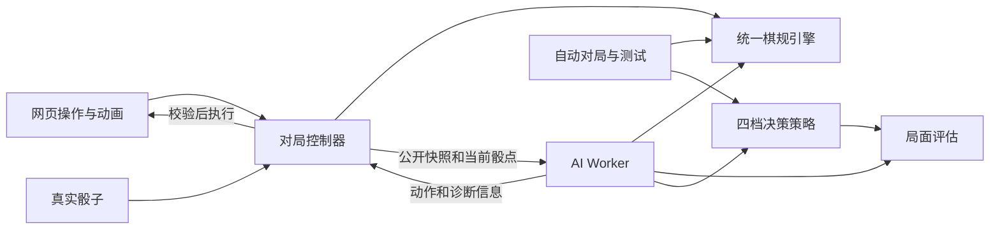

# Ludo 离线 AI 策略系统设计

日期：2026年09月07日  
设计版本：0.1  
状态：设计稿，尚未实现游戏、运行对局或验证性能。本文中的时间、权重、样本量和通过门槛均为拟定值。  
适用范围：本项目的双人 Ludo，玩家与 AI 各控制 4 枚棋子，最终以离线网页交付。

## 1. 目标与已确定的边界

核心目标：**在浏览器可接受的思考时间内，让 AI 尽可能强，并通过可复现测试验证四档难度有区别。**

产品边界：

- HTML、CSS、JavaScript 在本地运行，无后端、无账号、无 AI API、无运行时网络依赖。
- 初级、中级、高级、终极四档，共用相同棋规和公平骰子。
- 用户要求正常基础玩法，不另外增加特殊模式。首版不加入专家截图中的双子封路策略。
- AI 只能使用公开棋盘和已经掷出的骰点。未来骰点、真实随机数状态均不提供给 AI。
- 本轮只设计系统。算法名称、搜索深度、模拟次数都不能替代强度证据。

“尽可能强”的验证范围是选定棋规、目标设备、计算预算和测试对手；不承诺理论全局最优，也不承诺终极档必胜。

## 2. 对现有材料的取舍

已阅读原始需求、实物棋盘参考图和 4 张专家截图。截图尾号 10、12 的 SHA-256 相同，实际为 3 份不同截图；没有看到其声称的完整 Python 源码或测试结果。

| 材料中的建议 | 本设计的处理 |
| --- | --- |
| 合法动作、评分、风险、阶段分别处理 | 保留，拆成独立模块 |
| 吃子、推进、安全、完成、出营 | 作为局面特征，统一计算收益，避免重复奖励 |
| 距离越近危险值越大 | 改为根据骰点、合法动作和评估时间范围计算威胁 |
| 多枚敌子只取最大危险值 | 改为按骰点合并可吃事件，不能只取最大或直接相加 |
| 吃子统一相当于倒退约 56 步 | 改为实际位置价值损失，包含重新出营的成本 |
| 双子路障 | 首版关闭，不计算堵路或拆路收益 |
| 开局、中局、残局 | 保留阶段信息，但用多个指标连续调整，不因一枚棋子到家就判残局 |
| 激进、保守、均衡 | 属于性格，首版统一均衡，不直接对应难度 |
| 对每个走法模拟 N 局 | 作为蒙特卡洛候选算法，不能仅凭这句话称为完整 MCTS |
| 神经网络、开局库、对手建模 | 后续实验方向，首版不依赖这些功能 |

## 3. 统一棋规契约

### 3.1 来源与默认配置的边界

公开发行版本对叠子、出营步数、奖励等细节存在差异。用户没有指定某一发行版，因此本设计将“正常规则，不要特殊规则”理解为只提供一个基础玩法，不加入额外模式。下面列清首版默认配置，避免游戏、AI 和测试各用一套规则，不将其宣称为全球唯一标准。

四子出营、顺时针行进、落点吃子、精确到家、四子完成获胜这些核心玩法，可参考 [Jaques of London 的玩法介绍](https://www.jaqueslondon.co.uk/blogs/posts/history-of-ludo-how-jaques-brought-britains-best-loved-board-game)。[Tactic 的发行说明](https://www.tactic.net/site/rules/UK/40103.pdf)也说明掷 6 出营及再次掷骰，但其棋盘和部分细节不同，不能把整份说明当成本项目已完整采用的规则。

以下安全格、叠子、连续 6 等边界是本设计选定的兼容细则，来源页面未完整覆盖它们；它们尚未经游戏实现验证。规则配置需要随最终游戏一起展示和版本化。

| 项目 | 首版基础配置 |
| --- | --- |
| 阵营 | 玩家与 AI 使用对角两色，每方 4 子，只轮换这两方 |
| 先手 | 公平随机选择，测试中显式指定并交换先后手 |
| 出营 | 掷出 6，将一枚基地棋子放到本色起点；占用本次动作，不再额外前进 6 格 |
| 掷出 6 时的选择 | 可以出营，也可以移动已在场棋子 |
| 行走 | 顺时针，骰点不可拆分，有合法走法时必须选择一个 |
| 连续 6 | 第 1、2 个连续 6 结算后再掷；第 3 个不走棋并换人，保留前两次移动 |
| 连续计数 | 出现非 6 骰点或换人后归零 |
| 无合法动作 | 消耗本次骰点；若是第 1、2 个连续 6，仍再掷，否则换人 |
| 安全格 | 四个起点与四个标记安全格；允许双方同格，不发生吃子 |
| 普通格吃子 | 恰好落到对手所在普通格，将该格所有敌子送回基地；经过敌子不吃 |
| 己方叠子 | 可以同格，最多为己方 4 子；不阻止任何棋子经过，不提供普通格免疫 |
| 归家通道 | 仅本色可进入，无敌方吃子；仍需精确点数到终点 |
| 超出终点 | 该棋子本次不可走，不反弹、不自动截短步数 |
| 完成棋子 | 留在终点，不再参与移动 |
| 额外奖励 | 吃子和单子到家均不额外奖励掷骰 |
| 获胜 | 最后一枚到家后立即结束，优先于任何再掷处理 |

配置标识拟定为 `basic-ludo-1v1@1`。任何细则或路线变化都需要更换规则版本，并重新执行强度测试。首版没有规则切换菜单，也不把开发中的规则配置做成用户需要理解的技术选项。

### 3.2 棋盘和位置表示

公共环路使用 52 个物理格，四个阵营起点相隔 13 格。本版以红色起点作为公共环路的索引 0，另一对战阵营位于索引 26。安全格集合为 `{0, 8, 13, 21, 26, 34, 39, 47}`。这是拟定棋盘数据，需要在画面中逐个标记核对。

每色有独立的有序路线 `route[color]`：

- `progress = -1`：基地。
- `progress = 0..50`：公共路线，该色 `progress=p` 对应 `ring[(startOffset+p) % 52]`。
- `progress = 51..55`：该色 5 个专属归家格。
- `progress = 56`：中央终点，已完成。

这里 52 是整个公共环路的格数，单色在进入专属通道前只使用其中 51 个落点。它不是“吃子固定让对手损失 56 步”的依据。

实现时将上述映射固化为完整路线表，移动逻辑使用 `route.length - 1`，不在各个函数中重复写路线长度。路线索引用于推进，物理格 ID 用于吃子和安全判断；两个阵营相同的路线索引不代表相同的物理格。专属通道的格 ID 带有颜色，不能互相误判吃子。

验收前必须逐格检查起点、绕角、专属通道入口、最后一步与画面坐标一致。参考照片用于视觉布局，不能代替这张可测试的路线表。

## 4. 系统结构



图中的棋规引擎和评估模块只有一份源代码；构建时可分别放入主线程与 Worker，不能各维护一套规则。测试使用同一内核。

| 模块 | 职责 | 不承担的工作 |
| --- | --- | --- |
| 棋规引擎 | 合法动作、骰点结算、移动、吃子、换人、终局 | 随机数、动画、网络、存档 |
| 对局控制器 | 持有真实状态、生成真实骰点、发送 AI 请求、验证返回动作 | 搜索策略评分 |
| 局面评估 | 位置、安全、机动性、阶段和解释信息 | 修改棋盘、决定骰点 |
| 决策策略 | 根据难度比较合法动作 | 修改真实棋盘或访问真实 RNG |
| Worker 管理器 | 时间预算、消息、取消、异常兜底 | 承诺搜索一定找到最优解 |
| 测试与评测 | 固定局面、对局、统计、性能与复现记录 | 给真实玩家操控胜率 |

拟定接口如下，仅为设计签名，不是现有代码：

```text
getLegalActions(state, rules) -> Action[]
applyRoll(stateAwaitingRoll, die, rules) -> nextState
applyAction(stateAwaitingMove, action, rules) -> nextState
getTerminalResult(state) -> winner | null
evaluate(state, perspective, config) -> value + features
chooseAction(request) -> action + diagnostics
```

`applyRoll`、`applyAction` 为确定性纯函数，不改变输入，不暗中调用随机函数。主线程负责把新状态提交为真实状态。动作仅表示“移动哪枚棋子”，不能由 AI 返回任意终点坐标。

## 5. 状态与回合结算

规则状态至少包含：

```text
rulesetId / rulesetVersion / boardVersion
activePlayer
phase = awaitingRoll | awaitingMove | finished
pendingDie = null | 1..6
consecutiveSixes = 0..2
tokenProgress[2][4]
winner = null | playerId
```

`gameId`、`stateRevision` 属于控制器元数据，单独用于请求与存档校验。“动画中”和“思考中”属于界面状态，不能成为隐藏的棋规变量。

一次骰点结算顺序：

1. `applyRoll` 接受一个已生成的骰点。
2. 若形成第三个连续 6，直接换人、清空骰点和连续计数，不进入选子阶段。
3. 生成合法动作；没有动作则消耗本次骰点，并按是否获得再掷处理。
4. 有动作时等待选择，`applyAction` 完成移动、吃子、到家。
5. 检查终局，若获胜立即结束。
6. 否则清空骰点，再掷或换人。

因此“没有合法动作”不等于任何情况下都换人；“掷了三次骰子”也不等于“连续三次 6”。

## 6. 局面评估

### 6.1 先使用少量可解释特征

每个候选走法都先在副本上完整结算，再评价走后的局面。最终目标是获胜，局面特征只是有限搜索深度下的近似。

起始评估结构：

```text
z = 位置价值差
  + w_m × 机动性差
  - w_r × 下一次受威胁的预期损失差
V = 0.95 × tanh(z / scale)

真实终局：己方获胜为 +1，己方失败为 -1。
```

所有档位优先选择立即赢下整局的动作。非终局数值严格处于 `(-0.95, 0.95)`，避免普通奖励高于已经获胜。`V` 叫局面价值，未经独立校准不显示为胜率。

| 特征 | 定义 | 要避免的错误 |
| --- | --- | --- |
| 位置价值 | 每枚棋子沿路线的位置价值，加总后做双方差值 | 不仅使用本次移动步数，因为同一骰点下多数候选都走相同步数 |
| 基地成本 | 基地位置赋较低价值，反映尚未出营及再次等待的成本 | 不把所有棋子的出营成本都固定说成 6 回合 |
| 完成收益 | 完成状态在位置价值曲线中单独取值 | 不再叠加同义的到家奖励和完成数量奖励 |
| 安全状态 | 公共安全格和专属通道的短期捕获威胁为零 | 不宣称安全格保证今后永远安全 |
| 机动性 | 对下一次 1..6 的合法选择计数及无动作概率，等价后继去重 | 不因四枚基地棋子等价出营而认为有四种不同战术 |
| 威胁损失 | 按骰点枚举对手可造成的位置价值损失 | 不使用距离倒数冒充概率；不把重叠事件直接相加 |

吃子本身已使对手的位置价值下降，基础评估不再额外加固定 `+100`。普通格叠子被同时吃掉时按实际全部位置损失计算。实际走子造成的损失与对未来被吃的风险估计，时间范围必须区分。

为保证初值可直接实现，机动性固定为 `M(p) = (1/6) × Σ(n_d / 4)`，其中 `n_d` 是该方在骰点 d 下去重后的合法后继数量，无动作记 0，取值范围为 `[0,1]`。无动作概率另外记录用于解释，首版不再重复加入一项无动作惩罚。

机动性和静态威胁都在“该方假想开始新回合”的投影状态中计算，即保留棋盘，设相应活动玩家、清空当前骰点、连续 6 计数置 0。两方采用相同投影，保证特征含义对称。它们是布局指标；真实的当前骰点和连续 6 次数始终由搜索状态保留并展开。

### 6.2 初始位置曲线与调参范围

为使实现有明确起点，提供一组未经验证的初始化参数，允许在开发集调节：

```text
基地：v = -0.15
公共路线：v = 0.60 × (progress / 50) ^ 1.25
专属通道：v = 0.70 + 0.04 × (progress - 51)
完成：v = 1.00

w_m = 0.15
w_r = 0.50
scale = 2.00
```

这组参数仅是启动实验所需的配置，不是最优权重，也不等于概率。公共段、通道、完成的价值在同一条曲线上表达；通道本身不再叠加一次“进入安全列 +80”。

调参先调整少量参数和曲线形状，保持前进价值单调、交换双方后价值反号等基本约束。每次保留不带风险项、不带机动性项的对照版本，确认新增特征是否改善同预算表现。

### 6.3 威胁计算的含义

区分三个不同量：

1. **下一掷的吃子机会概率**：哪些骰点存在至少一条合法吃子走法。
2. **对手策略下的被吃概率**：还取决于该策略实际选择哪枚棋子。
3. **完整回合的累计风险**：还包含 6 再掷与之后的选择。

基础风险特征采用第一个量及最坏合法吃子损失，作为偏保守的启发式；高级的搜索负责实际展开对手选择与后续骰点。

例如对手下一次掷骰、路径合法、普通格可吃时，相距 1 格和 4 格各对应一个骰点，单枚威胁均为 `1/6`；两枚分别对应 1、4 时，事件并集为 `{1,4}`，机会概率为 `2/6`。两枚都对应 4 时仍只有一个骰点，不能加成 `2/6`。

对每个骰点，枚举对手全部合法动作，计算该动作会使己方损失多少位置价值，再取最大损失；最后按骰点概率求平均。存在多枚可吃目标时，对手本次仍只能选择一个动作，不能把互斥行动的损失都累计进去。

具体定义 `loss(a,p) = Σ[v(被捕获前的位置) - v(基地)]`，只对动作 a 捕获的 p 方棋子求和；没有捕获时为 0，不把对手自己的推进收益算进损失。`R(p) = (1/6) × Σ_d max_a loss(a,p)`，没有合法动作时该骰点贡献为 0。公式中的风险差明确为 `R(己方) - R(对手)`。

风险项只估计当前切点之后尚未展开的未来；搜索已经展开的吃子结果不能再次作为事件罚分。对手尚未获得回合时，“假设其立即掷骰”的风险只是静态威胁指标，不能标为下一实际回合概率。该指标若在对照实验中误导搜索，降低权重或移除。

### 6.4 阶段与性格

阶段变量使用双方完成数量、基地数量、归家通道数量、剩余距离等信息，连续插值调整权重。单枚完成不触发全局“残局模式”。首轮基线保持静态权重，阶段调整作为独立实验加入，防止一次改动过多而无法定位收益。

首版四档都采用均衡性格。后续如增加性格，可在价值相近的候选中表达进攻或保守偏好，不通过性格破坏立即获胜和明显战术选择。

## 7. 四档难度

下面的预算为前台活动页面中的初始计算预算，不含刻意播放的动画。实际可达到的搜索深度依赖局面与设备，需要测量。

| 档位 | 首版算法 | 初始计算预算 | 玩家可感知的目标 |
| --- | --- | --- | --- |
| 初级 | 立即获胜优先，其余不同合法后继均匀随机 | 5 ms | 有自然失误，能完整下完 |
| 中级 | 比较所有候选的走后局面评分 | 20 ms | 抓住吃子、完成、出营等明显机会 |
| 高级 | 使用中级结果打底，迭代加深的概率对抗搜索 | 150 ms | 预判骰点和对手应对，减少短视走法 |
| 终极 | 先用更大预算的概率对抗搜索作为基准；同预算挑战算法胜出后替换 | 600 ms | 在同一设备预算约束下争取更高整体胜率 |

去重依据完整后继规则状态，而非仅棋子坐标；等价动作仍保留一个可在界面执行的棋子 ID。只有一个不同后继时直接执行，不为了显示“思考”空耗预算。

算法选择使用同等实际耗时条件；产品四档使用各自最终预算。更深搜索未必在每个局面都更好，终极是否稳定强于高级须通过正式验收。

## 8. 高级：概率对抗搜索

采用 expectiminimax 思路：己方选择取最大价值，对手选择取最小价值，骰子节点按概率加权。可参考 [OpenSpiel 的 expectiminimax 实现](https://github.com/google-deepmind/open_spiel/blob/master/open_spiel/python/algorithms/minimax.py)。本项目使用自己的轻量 JavaScript 实现，不将 OpenSpiel 或 Python 加入网页运行依赖。

### 8.1 深度的统一定义

一个深度单位是“未来一次掷骰及该骰点对应的走子或强制跳过的结算”，不是完整玩家回合。这样不会因连续 6 反复轮到同一方而弄错取最大或取最小。

根节点的骰点已经知道，先枚举根动作，再搜索后续掷骰结算步。搜索在骰点已经结算的状态截断，不在掷到点数、尚未选子时直接丢弃选择。

```text
searchBeforeRoll(state, depth, perspective):
    若真实终局：返回 +1 或 -1
    若 depth 为 0：返回局面评估
    检查预算，超限则中止本轮，不返回伪装为完整的值

    对 die = 1..6：
        next = applyRoll(state, die)
        若该骰点自动结算，无须选子：
            branchValue = searchBeforeRoll(next, depth - 1, perspective)
        否则：
            对 next 的全部合法动作 a：
                child = applyAction(next, a)
                values[a] = searchBeforeRoll(child, depth - 1, perspective)
            若 next.activePlayer == perspective：取 max(values)
            否则：取 min(values)
        累加 branchValue / 6
    返回完整期望值
```

第三次 6、无子可走、再次掷骰均由棋规引擎决定，搜索不另写一套例外规则。对手被假设为合理竞争者；对手最优应对也是有限深度模型中的近似，不是对真人行为的准确预测。

### 8.2 搜索截止与优化

先完整比较所有根动作的静态价值，保存备用动作。随后完整完成深度 1、2、3 等逐层搜索；只有某一层所有根动作和其骰子分支都完成后，才整体更新推荐动作。

- 中途到期返回最后完整层的结果，不能拿某个动作的深层分数与其他动作的浅层分数直接比较。
- 部分骰子分支未计算时，不把已完成分支重新归一化成“完整期望”。
- 根动作全部保留，只做排序与等价状态去重，不按初始分数删除看似较弱的走法。
- 初版不直接套用普通确定性 alpha-beta 剪枝到机会节点。若增加区间剪枝，必须单独证明界限正确并测试。
- 使用完整结果缓存、增量位置特征、紧凑状态复制改善吞吐；保持一个简单参考实现作对照。

缓存键包含规则及棋盘版本、棋子位置、活动玩家、阶段、当前骰点、连续 6 计数、搜索视角、剩余深度、评估版本。只保存完整计算值；跨版本不复用。缓存容量初始上限 20,000 项，达到上限淘汰，不无限增长。

每个 AI 实例的缓存相互独立，每局开始清空，局内复用，重开不继承上局缓存。浏览器和批测采用相同生命周期。骰点按 1 到 6 遍历，合法动作先按棋子 ID 稳定排序；搜索可以按上一完整层分数排序，同分再按棋子 ID。除初级外，最终同分也采用该稳定规则。缓存使用确定性的最近使用淘汰顺序。

节点额度初始口径为每次进入搜索函数记 1 次，包括缓存命中；模拟额度同时记录完整模拟数和实际结算步数。计数口径、排序、缓存容量及淘汰方式都带配置版本，防止同一额度因不同缓存历史或计数方法而失去可复现性。

## 9. 终极：以基准和挑战实验确定最终算法

### 9.1 默认可实现基准

使用同一概率搜索，将预算提高到 600 ms，并使用缓存和迭代加深。它先成为可复现的终极候选，是否能作为正式终极档，取决于与高级档的测试差异。

### 9.2 第一挑战算法：有策略的蒙特卡洛续玩

对每个不同根动作，在副本上反复继续游戏。模拟双方先使用同一版中级策略，之后在验证集比较更强、不同风格的模拟策略，避免只假设对手随机乱走。

- 所有根候选都获得基本模拟额度，每轮给每个候选完成一次模拟，完整轮次后才更新结果。
- 优先把模拟运行到终局，胜负记为 +1、-1；初始单次最多模拟 128 个后续掷骰结算步，未到终局则使用同一局面评估。
- 分开记录终局模拟数量、截断数量和平均价值。混合终局与截断评分时，名称是估计价值，不是胜率。
- 模拟随机流独立于真实骰子。对候选使用预定义的模拟种子分组减少比较噪声，不允许访问真实未来序列。
- 超时只比较完整模拟轮次，保留启动时的备用动作。
- 128 步是初值，需要通过验证集检验截断偏差和计算成本。

### 9.3 第二挑战算法：MCTS

若更简单的方法在预算内仍表现不足，再实现维护搜索树的 MCTS，明确选择、扩展、模拟、回传，并按真实概率处理骰子节点和对手选择。它可把计算分配给有希望的分支，但是否更强依赖问题和配置。[MCTS 方法参考](https://www.lamsade.dauphine.fr/~cazenave/A%2BSurvey%2Bof%2BMonte%2BCarlo%2BTree%2BSearch%2BMethods.pdf)

不在第一个版本同时堆入神经网络、开局库和复杂对手模型。对局数据和验证流程稳定后，可增加有限残局的精确解作为局部校验或增强，但不把尚未求解的局面标为必胜。

### 9.4 晋级条件

候选算法在同设备、同 600 ms 时间及内存预算下，与基准、其他档位、固定风格对手比较。只有在验证集表现与耗时综合更优时才冻结为正式候选，然后进入独立留出测试。

不预先承诺“搜索加模拟一定更强”。终极应采用通过对照实验的版本；如果仍未证明强于高级，就继续改进，不仅凭名称宣称四档已经完成。

## 10. 浏览器执行、兜底与公平骰子

### 10.1 单文件离线交付

开发时分模块，交付时将 CSS、SVG、普通脚本及 Worker 源码内嵌在一个 HTML 中。通过 `Blob` 和对象 URL 启动专用 Worker，不依赖外部模块下载、CDN、动态网络加载或 Service Worker。嵌入 Worker 的方式可参考 [MDN 示例](https://developer.mozilla.org/en-US/docs/Web/API/Web_Workers_API/Using_web_workers#embedded_workers)。

这仍需要在目标浏览器的 `file://` 入口实际验证。桌面 Chrome、Edge 的本地文件是首要验收环境；手机浏览器通过静态网址访问另作验收，不能用桌面窄窗口等同于真机本地文件测试。

### 10.2 消息契约

```text
请求：
gameId, requestId, stateRevision
rulesetVersion, boardVersion, strategyVersion, evaluationVersion
公开状态快照, difficulty, budgetProfile, budgetMs, simulationSeed

返回：
对应请求标识与版本, action
completedDepth, visitedNodes, completedRollouts
terminalRollouts, truncatedRollouts, elapsedMs
stopReason, fallbackReason, featureExplanation
```

主线程只接受身份、版本、回合和动作合法性都通过检查的返回值。Worker 不能把它的棋盘副本覆盖回真实状态。

重新开局时递增状态版本并终止旧 Worker，清理计时器、监听及不再使用的对象 URL。同步搜索期间不能指望普通取消消息立即被处理。过期结果一律丢弃。

### 10.3 预算和页面响应目标

所有数字都是拟定验收目标，尚无测量结果。

| 指标 | 目标 |
| --- | --- |
| 初级、中级暖启动决策端到端 P95 | 分别不超过 30 ms、60 ms |
| 高级暖启动决策端到端 P95 | 不超过 250 ms |
| 终极暖启动决策端到端 P95 | 不超过 850 ms |
| Worker 首次启动 | 单独报告，暂定目标不超过 250 ms，不混入纯搜索耗时 |
| 前台请求硬兜底 | 从提交请求起 1500 ms 内提交一个重新校验过的合法动作 |
| 主线程响应 | 不因 AI 计算产生超过 50 ms 的长任务；重开操作应及时反馈 |
| 稳定性 | 规则错误、非法动作、旧结果覆盖、崩溃均为 0 |
| Worker 故障兜底率 | 正式兼容性和性能样本中为 0；故障注入测试另计 |

150/600 ms 是 Worker 自身的搜索软预算。正常预算用尽并返回完整结果不是故障。1500 ms 是前台应用兜底目标，不是浏览器后台调度的保证；标签页隐藏后暂停新请求，恢复时丢弃过期结果并按当前状态重算。

每个上下文使用自己的单调时钟测量耗时，传递相对 `budgetMs`，不直接混用主线程与 Worker 的绝对时间值。预算检查粒度先按小批节点设置，再根据目标设备实测限制超时幅度。

低配置设备可以使用独立的预算配置，四档在该配置下重新校准和验收。不能在手机上静默大幅降低终极计算量，同时沿用桌面的强度结论。超慢或不支持 Worker 的环境允许基础策略继续游戏，但需要标明兼容模式，不宣称已验证终极强度。

### 10.4 失败时继续游戏

发送搜索请求前，控制器准备一个合法备用动作。Worker 创建失败、抛错、返回非法动作或触发硬截止时，重新校验当前状态后使用备用动作。

不重掷骰，不改变规则，不跳过有合法动作的回合。所有异常保留原因；故障测试通过只能证明可恢复，不能算作高级或终极算法正常完成。

### 10.5 随机流隔离

真实骰子、AI 随机选择、AI 模拟、视觉动画分别使用独立随机来源。生产环境的真实骰子可使用 [Web Crypto 的 getRandomValues](https://developer.mozilla.org/en-US/docs/Web/API/Crypto/getRandomValues)，通过拒绝采样均匀映射到 1..6，避免整数直接取模的偏差。

以 32 位无符号整数为例，仅接受小于 `floor(2^32 / 6) × 6 = 4294967292` 的值，再取余加 1。该映射是本设计的算术约定。Web Crypto 不可用时不切换到“按难度调整”的骰源，应明确记录环境问题。

测试用可注入的、带版本的确定性 RNG 代替生产骰源。固定真实骰子种子时，改变模拟次数和动画次数不改变真实 RNG 输出序列；不同走法可以改变消耗次数和对局长度，不能要求不同策略最终看到完全相同数量的骰点。

## 11. 测试与四档差异验收

### 11.1 三类证据分开报告

1. 正确性：棋规、状态和算法是否按约定工作。
2. 强度：在约定样本和对手下，高档是否具有可测优势。
3. 体验：目标浏览器的耗时、响应、断网和恢复是否合格。

只有三类均通过，才可称四档 AI 验收完成。设计审查、文件检查、模拟局数都不能单独替代上述证据。

### 11.2 固定局面与独立参考实现

先准备约 60～80 个手工核对的规则与战术局面，另做生成状态的不变量测试。

| 组别 | 必须覆盖的情况 |
| --- | --- |
| 路线 | 两色绕角、公共格相遇、进入专属通道、恰好到家、超点不可走 |
| 出营 | 6 出营只到起点、6 可改走场内子、非 6 不可出营 |
| 回合 | 普通换人、第一次/第二次 6、第三次 6、非 6 重置、6 无合法动作后再掷 |
| 吃子 | 普通单子、普通叠子全回营、安全格不吃、经过不吃、归家通道不混色 |
| 终局 | 最后一子到家立即结束，结束后禁止再掷和再走 |
| 风险 | 单敌子不同距离、多个不同骰点、相同骰点重叠、6 后续行动的威胁 |
| 搜索 | 一两步可完整穷举的局面，机会概率求和，连续行动的最大/最小方向 |
| 公平 | 搜索不改原状态、不消耗真实 RNG、改变难度不修改骰源 |
| 取消与异常 | 重开、连续点击、Worker 抛错、超时、非法返回、旧请求返回 |
| 对称性 | 交换阵营和视角后的价值反号，棋子编号置换保持合法后继等价 |

规则与明确终局要求全部通过。对复杂战术，不把“人工评分最高”当成正确答案；必须有小范围完整穷举、独立实现或数学依据，否则只记录行为，不做伪正确性断言。

优化搜索与简单参考搜索，在相同深度、无时间中断时应得到相同价值和等价最优动作。实际低档随机选子不要求通过高阶战术的选招标准。

### 11.3 开发、验证与留出集

| 数据集 | 用途 | 使用方式 |
| --- | --- | --- |
| 开发集 | 排错、曲线和权重调整、风险特征对照 | 可以反复使用 |
| 验证集 | 算法选择、预算校准、样本量和门槛预注册 | 不作最终强度结论 |
| 留出集 | 配置冻结后的正式验收 | 不用于继续调参；失败后不能在同一集合上试到通过 |

棋规版本、策略版本、配置哈希、种子清单、设备预算、统计方法和样本量先写入评测 manifest。正式查看结果后不任意增加样本到显著为止。

同一发布验收默认只有一轮正式留出测试，禁止不断更换新种子重试到通过。如果提前计划多轮，必须在第一次查看结果前固定轮次，并为多轮、三组比较分配错误率额度；本文下一节的 `0.05/3` 仅适用于一次正式查看。失败记录必须保留，后续研发不能把失败历史从报告中删除。

### 11.4 相邻档位的主验收

预先指定三组：中级对初级、高级对中级、终极对高级。

每个独立主种子构成一个 seed block，运行四局：高档分别使用两种阵营，且各自轮换先手、后手。块内比赛有相关性，统计单位是整个块，不将四局假装成四个独立样本。

骰子序列由测试裁判生成，对 AI 隐藏。每块内的骰源配对规则在 manifest 中固定，模拟种子与真实骰源分别派生，不能把用于生成真实骰点的主种子发给 AI。

高档胜记 1，负记 0；仅明确存在的规则平局才记 0.5。本版没有主动平局规则，因此正常终局平均得分率就是胜率。先求每块四局平均，再对独立块计算总体均值和区间。

拟定正式起点为每组 400 块，即 1600 局，三组合计 4800 局。最终样本数根据验证集的块方差、预期优势和成本，在留出测试前冻结；该局数不能保证通过。

每组需要同时满足：

- 高档观察胜率至少 55%。
- 经过三组多重比较调整的单侧下置信界大于 50%。

拟采用 20,000 次以整块为单位的 BCa bootstrap，每组单侧置信水平为 `1 - 0.05 / 3 = 98.333...%`。区间覆盖是统计近似，不能解释为数学最优证明。计算实现可参考 [SciPy bootstrap](https://docs.scipy.org/doc/scipy/reference/generated/scipy.stats.bootstrap.html)；三组错误率分配依据 [NIST 对 Bonferroni 方法的说明](https://www.itl.nist.gov/div898/handbook/prc/section4/prc473.htm)。

必须在测试前固定区间方向、重采样种子和方法。BCa 区间退化或出现 NaN 时，该组判为证据不足并复查原因，不临时切换到另一种更容易通过的方法。若需要其它区间，必须提前明确其用途和错误率分配，不能以任一方法通过就认定通过。

若证据不足，报告未证实差异。四档中的任何相邻组不通过，都不能宣称全部四档已证明不同。不能通过偷偷削弱已冻结的低档或改变骰子，让新终极看起来更强。

### 11.5 对手面板与算法选择

除相邻档位外，在验证集保留随机、推进优先、吃子优先、保守及旧版搜索等固定对手。对手面板用于发现某算法只擅长欺负一种对手的问题，不据此宣称对所有玩家最强。

正式选择终极算法前，在同设备、同实际计算时间和内存条件下比较。不同算法的相同节点数不等于相同计算成本。发布四档时则使用各自已冻结的预算，这两类实验分开记录。

### 11.6 限制计算成本且保持证据有效

- 冒烟测试用少量种子和小额度，仅验证能运行，不算强度结论。
- 大规模对局用无界面的 JavaScript 测试运行器调用同一内核，关闭动画和人为等待。
- 先在目标设备把确定性节点/模拟额度校准到各档时间预算，发布配置同时包含操作额度及时间保护；预算达到任意一项即停止。
- 正式批测使用冻结的产品操作额度，不偷偷降低终极模拟次数。后台批测没有真实时间压力，另需目标浏览器对局确认时间保护没有经常提前截断；若二者动作或完成深度出现实质差异，批测不能直接代表该设备，需要重新校准或补做实际时间策略评测。
- 先跑一小批测吞吐，再估计正式总工时，不提前声称几分钟能完成。
- 按 seed block 并行，独立保存检查点、完成局、失败局和配置哈希。配置变化不能混入同一报告。
- 分析脚本可用开发机 Python，放入 `py/`；游戏成品不依赖 Python 或 Node。

正式对局初始保护上限为 10,000 次掷骰。到上限标为截断，不当作平局或从分母删除。排除引擎错误后提高上限、用同种子重跑；仍有截断时报告比例，并分别把未完成局计为高档负/胜做辅助敏感性分析。默认主验收要求预定留出局全部取得真实终局；仍有未完成局就不能通过，敏感性分析不能替代此门槛。

非法动作、状态损坏和引擎崩溃直接导致正确性验收失败，不能只作为一盘输棋淡化。

### 11.7 评测报告的必要字段

```text
规则、棋盘、策略、评估函数和 RNG 版本
构建标识与配置哈希
数据集用途、种子清单、块数、局数
对手、阵营、先手分配
胜/负/截断/错误数，胜率与调整后的下置信界
设备、浏览器、系统、预算配置
节点数、完成深度、模拟数、截断模拟占比
决策耗时 P50/P95/P99/max，冷启动耗时
软预算停止、时间保护提前停止、Worker 故障分别计数
测试通过/失败/证据不足及具体原因
```

## 12. 开发顺序与交付门槛

| 阶段 | 工作 | 可检查的结果 |
| --- | --- | --- |
| A | 固化规则、棋盘路线、纯函数状态机与独立参考测试 | 所有基础规则局面通过，尚不声称 AI 强 |
| B | 实现评估函数、初级与中级、自动对局记录 | 完整对局可复现，能解释候选走法差异 |
| C | 实现概率搜索、预算、缓存和 Worker 生命周期 | 高级与终极基准可运行，完整层返回与故障恢复通过 |
| D | 调参、对照实验、必要时引入模拟挑战算法 | 验证集确定终极候选与预算配置 |
| E | 冻结配置、独立留出对局、目标浏览器测试 | 三组难度差异、正确性与体验均通过 |
| F | 构建单文件 HTML 并验证断网运行 | HTML 成品、模块源码、使用说明、规则说明与评测报告 |

只有阶段 E、F 完成后，才可对外称“已交付四档离线 AI”。如果某项未通过，报告具体未完成项，并保留已经验证的能力边界。

## 13. 本轮交付状态

本轮只完成策略设计文档。原始需求和图片保留，未实现游戏代码，未运行 AI 对局，也未验证本文的预算或胜率门槛。下一步实施时以这份设计和冻结后的规则配置为依据，先完成规则引擎与可复现测试，再逐级增加策略能力。
